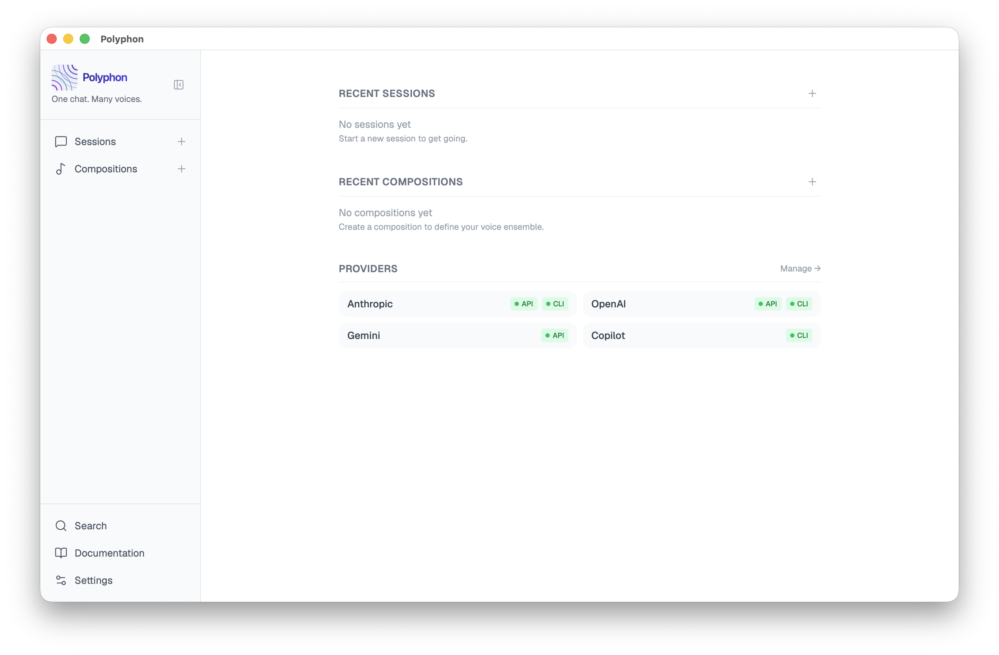

# Polyphon

**One chat. Many voices.**



Polyphon is an Electron desktop application for orchestrating conversations between multiple AI agents simultaneously. Agents can respond to the user and to each other — like a conductor leading an ensemble.

---

## Features

- **Multi-agent sessions** — add any number of voices to a conversation and watch them reason together
- **Compositions** — save and reuse named multi-voice configurations across sessions
- **Mixed providers** — combine API-key voices (Anthropic, OpenAI, Gemini), CLI voices (`claude`, `codex`), and custom OpenAI-compatible endpoints (Ollama, LM Studio, vLLM) in the same session
- **Tones** — per-voice tone overrides (professional, collaborative, concise, exploratory, teaching) or custom tones
- **Conductor profile** — set your name, pronouns, and context so voices address you correctly
- **@mention routing** — direct a message to a specific voice or broadcast to all
- **Local-first** — no cloud dependency required; your data stays on your machine
- **No telemetry** — never phones home without explicit opt-in

---

## Voice Providers

| Provider | Type | Requires |
|---|---|---|
| Anthropic (Claude) | API | `ANTHROPIC_API_KEY` |
| OpenAI | API | `OPENAI_API_KEY` |
| Google Gemini | API | `GEMINI_API_KEY` |
| Claude Code (`claude`) | CLI | `claude` CLI installed |
| Codex (`codex`) | CLI | `codex` CLI installed |
| Custom (Ollama, LM Studio, vLLM, …) | OpenAI-compatible | Endpoint URL |

API keys are read from your shell environment — set them in `.zshrc` / `.bash_profile` and they are available even when launching from the Dock.

---

## Installation

### Download

Pre-built installers for **macOS (Apple Silicon)** are available on the [Releases](https://github.com/polyphon-ai/polyphon/releases) page.

### Build from source

**Prerequisites:** Node.js 22+, npm

```sh
git clone https://github.com/polyphon-ai/polyphon.git
cd polyphon
make install
make run
```

---

## Development

```sh
make install        # install dependencies + git hooks
make run            # start in development mode (hot reload)
make build          # package the Electron app
make dist           # create distributable installers
```

### Testing

```sh
make test              # unit + integration + e2e
make test-unit         # Vitest unit tests only
make test-integration  # Vitest integration tests only
make test-e2e          # Playwright e2e with mocked voices (CI-safe, no credentials needed)
make test-e2e-live     # e2e against real providers (opt-in, never CI)
make test-openai-compatible-live # e2e against real openai compatible providers (ollama)
make test-watch        # Vitest in watch mode
```

### Lint

```sh
make lint           # TypeScript type-check (no emit)
```

### Developer tools

Chrome DevTools are closed by default in `make run`. To open them at launch:

```sh
POLYPHON_DEVTOOLS=1 make run
```

---

## Community

- **Website:** [polyphon.ai](https://polyphon.ai)
- **X / Twitter:** [@PolyphonAI](https://x.com/PolyphonAI)
- **GitHub Org:** [github.com/polyphon-ai](https://github.com/polyphon-ai)
- **GitHub:** [polyphon-ai/polyphon](https://github.com/polyphon-ai/polyphon)
- **Reddit:** [u/PolyphonAI](https://www.reddit.com/user/PolyphonAI)
- **Email:** [hello@polyphon.ai](mailto:hello@polyphon.ai)

---

## Contributing

Issues and bug reports are welcome. This project is not currently accepting pull requests.

---

## License

[Apache 2.0](LICENSE.md) © 2026 Corey Daley

---

## Tech Stack

| Layer         | Technology                           |
|---|---|
| Shell         | Electron 41                          |
| UI | React 19 + TypeScript + Tailwind CSS v4 |
| State | Zustand 5 |
| Database | `better-sqlite3` v12 + SQLCipher 4.14.0 (AES-256 whole-database encryption) |
| Build | Electron Forge + Vite 7 |
| Testing | Vitest 4 + Playwright |

---

